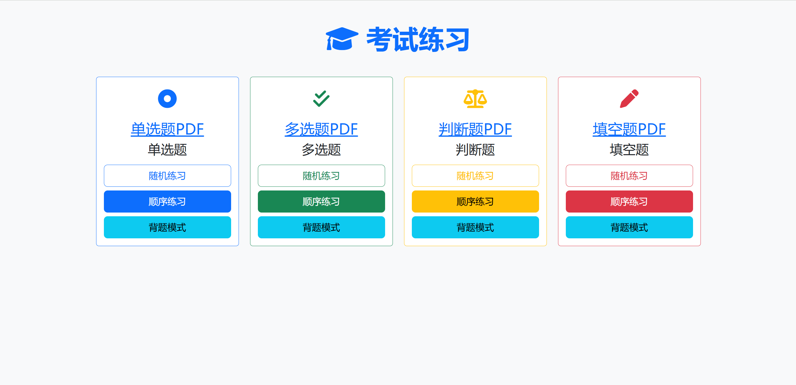

# 在线做题练习项目

## 说明

一般练习测试题的时候发现纯靠背题还是很容易忘记，所以做了这个在线练题的工具，可以使用脚本按照特定格式导入excel里的题目到数据库中，当然也有在线很成熟的产品，用过有广告不太方便，写了这个项目。



## 部署说明

1. 克隆项目到本地

   ```
   git clone 
   ```

2. 进入exam路径

   ```
   cd exam
   ```

3. 使用docker-compose直接启动项目

   ```
   docker-compose up -d
   ```

4. 按照exam.xlsx格式内容整理出来需要上传的试题，支持单选、多选、判断与填空

   

5. 使用exam.py脚本上传到数据库，建议自己后期修改数据库配置信息，注意安装python库：

   ```
   pip install pandas mysql-connector-python openpyxl
   ```

   直接运行即可上传

   ```
   python3 exam.py
   ```

6. 上传完成后直接访问项目地址，即可正常练习

   

   